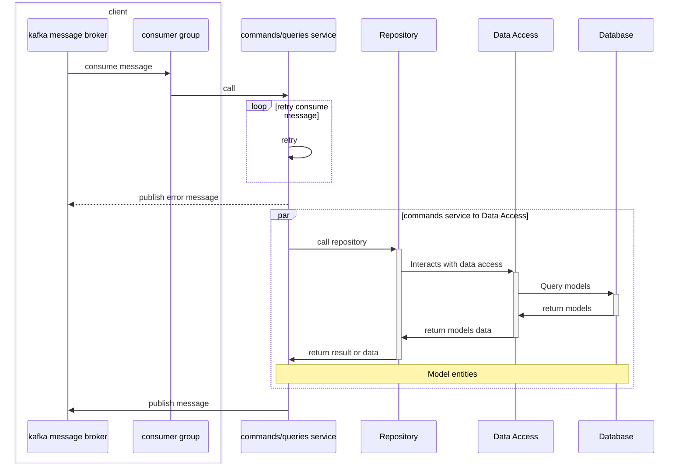

## Golang CQRS microservices 

#### 👨‍💻 Full list what has been used:
[Kafka](https://github.com/segmentio/kafka-go) as messages broker<br/>
[gRPC](https://github.com/grpc/grpc-go) Go implementation of gRPC<br/>
[PostgreSQL](https://github.com/jackc/pgx) as database<br/>
[Jaeger](https://www.jaegertracing.io/) open source, end-to-end distributed [tracing](https://opentracing.io/)<br/>
[Prometheus](https://prometheus.io/) monitoring and alerting<br/>
[Grafana](https://grafana.com/) for to compose observability dashboards with everything from Prometheus<br/>
[MongoDB](https://github.com/mongodb/mongo-go-driver) Web and API based SMTP testing<br/>
[Redis](https://github.com/go-redis/redis) Type-safe Redis client for Golang<br/>
[swag](https://github.com/swaggo/swag) Swagger for Go<br/>
[Echo](https://github.com/labstack/echo) web framework<br/>

## For local development 🙌👨‍💻🚀:

### Jaeger UI:

http://localhost:16686

### Prometheus UI:

http://localhost:9090

### Grafana UI:

http://localhost:3000

### Swagger UI:

http://localhost:5001/swagger/index.html

### Kafka console UI

Can use [conduktor](https://www.conduktor.io/) 

```
curl -L https://releases.conduktor.io/quick-start -o docker-compose.yml 
&& docker compose up -d --wait 
&& echo "Conduktor started on http://localhost:8080"
```

Add new cluster host by value of KAFKA_ADVERTISED_LISTENERS on docker-compose file to connect


#### Follow step to serve on local

```
1: make local or docker_dev                 // for run docker compose files
2: make migrate_up                          // run sql migrations
3: make mongo                               // run mongo init scripts
4: make swagger                             // generate swagger documentation
```
p/s: please install [mongosh](https://www.mongodb.com/docs/mongodb-shell/install/), [migrate](https://github.com/golang-migrate/migrate) and [swagger](https://github.com/swaggo/swag) first

## Project struct:

### Overview


### Project structure
```
.
├── Makefile
├── README.md
├── api_gateway_service
│   ├── cmd
│   │   └── main.go
│   ├── config                            
│   │   ├── config.go
│   │   └── config.yaml
│   └── internal
│       ├── client
│       │   └── reader_service.go
│       ├── dto
│       │   ├── create_product.go
│       │   ├── product_list_response.go
│       │   ├── product_response.go
│       │   └── update_product.go
│       ├── metrics
│       │   └── metrics.go
│       ├── middlewares
│       │   └── middlewares.go
│       ├── products
│       │   ├── commands
│       │   │   ├── commands.go
│       │   │   ├── create_product.go
│       │   │   ├── delete_product.go
│       │   │   └── update_product.go
│       │   ├── delivery
│       │   │   └── http
│       │   │       └── v1
│       │   │           ├── handlers.go
│       │   │           └── routes.go
│       │   ├── delivery.go
│       │   ├── queries
│       │   │   ├── get_by_id.go
│       │   │   ├── queries.go
│       │   │   └── search_product.go
│       │   └── service
│       │       └── service.go
│       └── server
│           ├── http.go
│           ├── server.go
│           └── utils.go
├── diagram
│   └── system_diagram.svg
├── docker
│   ├── api_gateway.Dockerfile
│   ├── reader_service.Dockerfile
│   └── writer_service.Dockerfile
├── docker-compose.local.yaml
├── docker-compose.yaml
├── docs
│   ├── docs.go
│   ├── swagger.json
│   └── swagger.yaml
├── go.mod
├── go.sum
├── migrations
│   ├── 01_microservices_tables_init.down.sql
│   └── 01_microservices_tables_init.up.sql
├── monitoring
│   ├── prometheus.yml
│   └── prometheus_docker.yml
├── pkg
│   ├── constants
│   │   └── constants.go
│   ├── http_client
│   │   └── http_client.go
│   ├── http_errors
│   │   └── http_errors.go
│   ├── http_utils
│   │   └── http_utils.go
│   ├── interceptors
│   │   └── manager.go
│   ├── kafka
│   │   ├── client.go
│   │   ├── config.go
│   │   ├── constants.go
│   │   ├── consumer_group.go
│   │   ├── producer.go
│   │   ├── reader.go
│   │   └── writer.go
│   ├── logger
│   │   └── logger.go
│   ├── mongodb
│   │   └── mongodb.go
│   ├── postgres
│   │   └── postgres.go
│   ├── probes
│   │   └── probes.go
│   ├── redis
│   │   └── redis.go
│   ├── tracing
│   │   ├── jaeger.go
│   │   └── utils.go
│   └── utils
│       └── pagination.go
├── proto
│   └── kafka
│       ├── kafka.pb.go
│       └── kafka.proto
├── reader_service
│   ├── cmd
│   │   └── main.go
│   ├── config
│   │   ├── config.go
│   │   └── config.yaml
│   ├── internal
│   │   ├── metrics
│   │   │   └── metrics.go
│   │   ├── models
│   │   │   └── product.go
│   │   ├── product
│   │   │   ├── commands
│   │   │   │   ├── commands.go
│   │   │   │   ├── create_product.go
│   │   │   │   ├── delete_product.go
│   │   │   │   └── update_product.go
│   │   │   ├── delivery
│   │   │   │   ├── grpc
│   │   │   │   │   └── grpc_service.go
│   │   │   │   └── kafka
│   │   │   │       ├── consumer_group.go
│   │   │   │       ├── create_product_consumer.go
│   │   │   │       ├── delete_product_consumer.go
│   │   │   │       ├── update_product_consumer.go
│   │   │   │       └── utils.go
│   │   │   ├── queries
│   │   │   │   ├── get_by_id.go
│   │   │   │   ├── queries.go
│   │   │   │   └── search.go
│   │   │   ├── repository
│   │   │   │   ├── mongo_repository.go
│   │   │   │   ├── redis_repository.go
│   │   │   │   └── repository.go
│   │   │   └── service
│   │   │       └── service.go
│   │   └── server
│   │       ├── grpc_server.go
│   │       ├── server.go
│   │       └── utils.go
│   └── proto
│       └── product_reader
│           ├── product_reader.pb.go
│           ├── product_reader.proto
│           ├── product_reader_grpc.pb.go
│           ├── product_reader_messages.pb.go
│           └── product_reader_messages.proto
├── scripts
│   └── init.js
└── writer_service
    ├── cmd
    │   └── main.go
    ├── config
    │   ├── config.go
    │   └── config.yaml
    ├── internal
    │   ├── metrics
    │   │   └── metrics.go
    │   ├── models
    │   │   └── product.go
    │   ├── product
    │   │   ├── commands
    │   │   │   ├── commands.go
    │   │   │   ├── create_product.go
    │   │   │   ├── delete_product.go
    │   │   │   └── update_product.go
    │   │   ├── delivery
    │   │   │   ├── grpc
    │   │   │   │   └── grpc_service.go
    │   │   │   └── kafka
    │   │   │       ├── consumer_group.go
    │   │   │       ├── create_product_consumer.go
    │   │   │       ├── delete_product_consumer.go
    │   │   │       ├── update_product_consumer.go
    │   │   │       └── utils.go
    │   │   ├── queries
    │   │   │   ├── get_product_by_id.go
    │   │   │   └── queries.go
    │   │   ├── repository
    │   │   │   ├── pg_repository.go
    │   │   │   ├── repository.go
    │   │   │   └── sql_queries.go
    │   │   └── service
    │   │       └── service.go
    │   └── server
    │       ├── grpc_server.go
    │       ├── server.go
    │       └── utils.go
    ├── mappers
    │   └── product_mapper.go
    └── proto
        └── product_writer
            ├── product_writer.pb.go
            ├── product_writer.proto
            ├── product_writer_grpc.pb.go
            ├── product_writer_messages.pb.go
            └── product_writer_messages.proto
```

#### Note
- ./cmd: main file to start server
- ./config: read and load file config
- ./internal
  - /client: init client to call another services
  - /dto: define and mapping request response to delivery request
  - /metrics: init and config metrics for prometheus
  - /middlewares: define middle func
  - /products
    - /commands: create commands and publish to message broker
    - /queries: create queries and publish to message broker
    - /delivery: define router and handler for protocol (http, gprc, ...)
    - /service: define and init service
- ./docker: store dockerfile
- ./migrations: store migrate up and down file
- ./monitoring: config prometheus 
- ./pkg: define all package file or tool
  - /constants: define all const value or global value
  - /utils: define all utils func
  - /tracing: init config jaeger
  - ...: connection for database or third party
- ./proto: proto file
- ./script: migrate for mongodb
- ./reader_services: reader services consumer read data from cache db or slave db
- ./writers_services: writer services consumer write data to master db
- makefile: define all command for quick run

### struct of consumer (reader and writer services)

Flow handle message 



